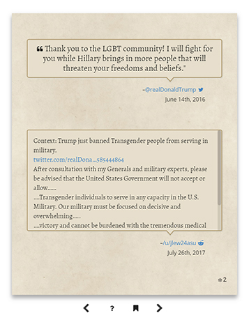

```
 _____ _       _____         _   _ _ _           _       _
|_   _| |_ ___| __  |___ ___| |_| | | |___ ___ _| |___  |_|___
  | | |   | -_| __ -| -_|_ -|  _| | | | . |  _| . |_ -|_| | . |
  |_| |_|_|___|_____|___|___|_| |_____|___|_| |___|___|_|_|___|
```
---
By gammagames  
Easily see trump's hypocrisy in a book style featuring posts taken from [/r/trumpcriticizestrump](https://www.reddit.com/r/TrumpCriticizesTrump/), highlighting the tweets and context for the lies  




Frontend:
======
[thebestwords.io](http://thebestwords.io)
------
(Public folder) A client side application using jquery, booklet, moment, semantic ui, 
underscore, backbone, and hammer hosted on and aws s3 bucket

📓 thebestwords.io - the main landing page  
🔥 thebestwords.io#hot - view the current hot page from the subreddit  
🕒 thebestwords.io#new - view the newest posts from the subreddit  
⭐ thebestwords.io#top/:time - view the top posts from the subreddit  
&nbsp;&nbsp;&nbsp;&nbsp;  :time - week | month | year | all  
📃 thebestwords.io#post/:id - view the tweet's page with a given (reddit) id  

Servers:
======
[api.thebestwords.io](http://api.thebestwords.io)
------
(server folder) A nodejs server hosted on amazon aws elastic beanstalk. Downloads a new cache from an s3 bucket 15 minutes and serves those json files

🔥 api.thebestwords.io/hot - json for the hot page from the subreddit  
🕒 api.thebestwords.io/new - json the newest posts from the subreddit  
⭐ api.thebestwords.io/top/:time - view the top posts from the subreddit  
&nbsp;&nbsp;&nbsp;&nbsp;🕒  :time - day | week | month | year | all  
📃 api.thebestwords.io/post/:id - json for a tweet with a given id  
🐦 api.thebestwords.io/tweet/:id - json for a tweet with a given id  
🐄 api.thebestwords.io/cow/:id? - cowsay for a tweet with an (optional) given id  
&nbsp;&nbsp;&nbsp;&nbsp;(if none provided, pulls random from a list)

other server
------
(cacheserver folder) A nodejs server hosted on amazon aws elastic beanstalk. Downloads a different batch of json data from reddit's servers and saves them to an s3 bucket for the other servers to download
